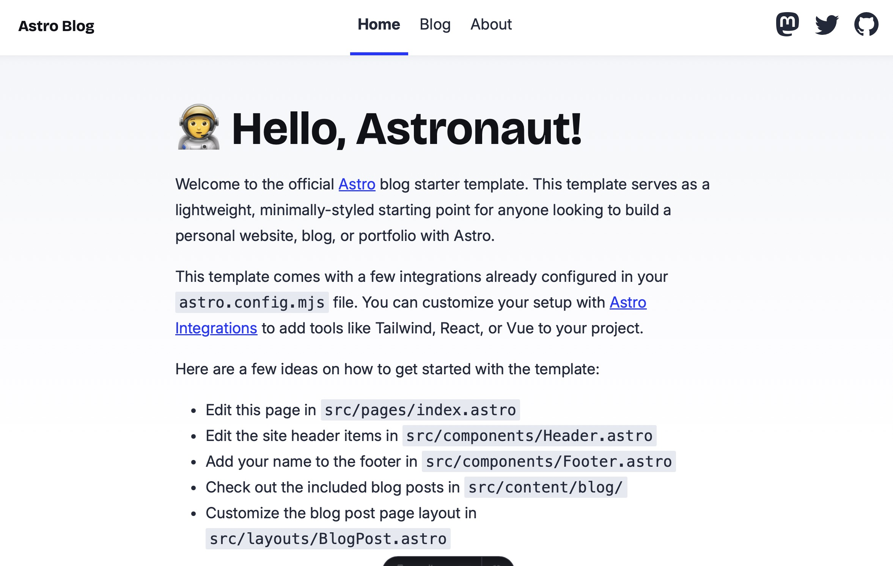

# 🚀 Astro Blog

A simple Astro blog template with sensible defaults, DX improvements, and instructions to get a new blog up and running as quickly and easily as possible.

The template includes detailed instructions for getting started, customizing things to your liking, and eventually deploying the blog.

## Getting started

To get started with this template, you need to create your own repository and clone it.

### Creating your own repository

This repository has been initialized as a template repository, so to create your own repository and Astro blog you can simply follow the guide below:

1. Press the "Use this template" button in the top right corner and choose "Create a new repository".
2. In the "Create a new repository" menu, choose a name and optional description for your new blog, and choose if you want to make it public or private.
3. Clone the repo as usual and get started!

### Installing dependencies and starting the blog

For the purposes of this document, I will assume that you use `bun`.

If you don't already have `bun` installed, you can install the latest version on the [Bun website](https://bun.sh).

Assuming you use macOS, you can simply run the script below:

```sh
curl -fsSL https://bun.sh/install | bash
```

And then either restart your terminal or source your shell config file.

For Zsh (macOS default):

```sh
source ~/.zshrc
```

Then navigate to the project root (where `package.json` is located) and install the required dependencies:

```sh
bun install
```

Finally, start and run the blog locally:

```sh
bun run dev
```

This will start the local Astro dev server at `localhost:4321`.

To view the blog in a browser, simply click the link in the terminal or input `localhost:4321` in the address field of your browser of choice.

You should see something like this:



### Adding your first blog post

Blog posts are written in Markdown or [MDX](https://mdxjs.com) and stored as collection entries in the `src/content/blog` [Astro content collection](https://docs.astro.build/en/guides/content-collections/).

Assuming you want to add a new blog post `blog-post.md`, you can follow the steps below:

1. Create a new file `blog-post.md` in the `src/content/blog` folder, so the final path is `src/content/blog/blog-post.md`.
2. Add the required [frontmatter](https://frontmatter.codes/docs/markdown) and whatever content you want.
3. Your blog post will now be available at `url/blog/blog-post/`

Please note that the following frontmatter properties are required as defined in `src/content/config.ts`:

- `title`
- `description`
- `pubDate`

This means that all the markdown files you write and put in `src/content/blog` need to include these properties as part of their frontmatter, unless you modify `src/content/config.ts` with a different schema.

## Features

### 100/100 Lighthouse performance

TODO: Verify and add info about this

### Markdown & MDX support

This template ships with Markdown and MDX support already configured and ready to go using [Astro content collections](https://docs.astro.build/en/guides/content-collections/#querying-collections) and the [Astro MDX integration](https://docs.astro.build/en/guides/integrations-guide/mdx/), so you can write `.md` or `.mdx` files in the `src/content/blog` folder and Astro will automatically convert and render it to a nice blog post in HTML.

If you are using VS Code, I strongly suggest that you install the following extensions:

- [MDX extension](https://marketplace.visualstudio.com/items?itemName=unifiedjs.vscode-mdx): to enable syntax highlighting for MDX files and some other nice to have features
- [markdownlint](https://marketplace.visualstudio.com/items?itemName=DavidAnson.vscode-markdownlint): to enable linting for markdown files, allowing for more consistent formatting and file structure.

### SEO and social media sharing friendly

This template is designed with SEO best practices in mind to help your blog be visible on Google and other search engines.

Canonical URLs, OpenGraph data, and sitemap support ensure that your site is easily discoverable and optimized for sharing.

#### Canonical URLs and OpenGraph data

Canonical URLs prevent duplicate content issues by specifying the preferred URL for a given page, helping search engines identify the primary source of your content.

This template ships with optional configuration options for OpenGraph data to improve your blog posts for social media sharing by enhancing your link previews with metadata like title, description, and images.

This stuff has been configured in a standalone component `BaseHead.astro` that can be imported and used on your blog pages. Assuming you have a page `index.astro` that represents the landing page of your blog, you can use it like so:

```js
---
import BaseHead from "@components/BaseHead.astro";
---

<!doctype html>
<html lang="en">
  <head>
    <BaseHead title="My blog" description="My blog description" />
  </head>
  <body>
  <!-- Content -->
  </body>
</html>
```

If you want, you can also include an optional `image` property to specify the image that should be visible when sharing the page on social media or other sites:

```js
---
import BaseHead from "@components/BaseHead.astro";
---

<!doctype html>
<html lang="en">
  <head>
    <BaseHead title="My blog" description="My blog description" image="/images/astro-blog.jpg" />
  </head>
  <body>
  <!-- Content -->
  </body>
</html>
```

This way, your link preview will look something like this:


#### Sitemap support

A Sitemap is an XML file that outlines all of the pages, videos, and files on your site. Search engines like Google read this file to crawl your site more efficiently. See [Google’s own advice on sitemaps](https://developers.google.com/search/docs/crawling-indexing/sitemaps/overview) to learn more.

This template ships with the [Astro sitemap integration](https://docs.astro.build/en/guides/integrations-guide/sitemap/) for automatically creating a sitemap file for your blog when building the project.

### RSS feed support

An RSS feed allows readers to subscribe to your blog and receive updates whenever new content is published.

This template includes built-in RSS feed generation through the `@astrojs/rss` package, as defined in `src/pages/rss.xml.js`. The feed automatically compiles your blog posts into an XML file and exposes it as an endpoint on your deployed blog.

### Light and dark mode support

The template includes support for both light and dark mode based on user preferences with the `prefers-color-scheme` CSS media feature.

All color customization options have been defined as CSS variables in `src/styles/variables.css`, so you can just update these to match your preferred color scheme.

This template uses the following pattern for defining light and dark mode colors and other styling properties:

```css
@media (prefers-color-scheme: light) {
  :root {
    --background-color: #fff;
  }
}

@media (prefers-color-scheme: dark) {
  :root {
    --background-color: #000;
  }
}
```

This means you have to define each variable twice, but when using it, you don't need to think about if light or dark mode is enabled—you simply use the `--background-color` variable and it will automatically reference the light or dark mode value based on user preferences.

I prefer this pattern because you have to define a value for light and dark mode anyway (define the same variable twice) and then you simply use all the variables as you would otherwise.

Please note that the template currently doesn't support switching between light and dark mode, it is strictly based on what the user has set as their preference on the OS level. Support for dynamically toggling between them will be added soon.

### Fonts included

This template includes the following two fonts:

- [Inter](https://rsms.me/inter/)
- [Bricolage Grotesque](https://ateliertriay.github.io/bricolage/)

Inter and Bricolage Grotesque are both very popular and available as [variable fonts](https://fonts.google.com/knowledge/introducing_type/introducing_variable_fonts) with [optical sizing](https://fonts.google.com/knowledge/glossary/optical_sizes) which means you can define whatever supported weight and font size you want, and the font will adapt to look as good as possible at that size.

#### How to use the fonts

Inter can be used for both headings and body text—especially since it was updated with optical sizing—however, I recommend using this font for body text and anything else that isn't headers.

Bricolage Grotesque _can_ be used for both headings and body text, but I would recommend that you use this font for headings, as it can become a bit too distracting for body text—especially for a blog.

I have defined the following CSS variables related to the fonts:

- `--primary-font`
- `--header-font`

`--primary-font` has been configured to use the Inter variable font The intended usage is anything other than headers. You most likely won't need to define this for components since it will already be defined for most text styles in `global.css`.

`--header-font` has been configured to use the Bricolage Grotesque variable font. The intended usage is headers.

### Automatic formatting

`prettier` has been added as a dev dependency for automatic formatting support. You can format all the applicable files in the project using the following command:

```sh
bun run format
```

If you prefer to check which files are unformatted and formatting them yourself, you can run:

```sh
bun run format-check
```

If you use VS Code, I strongly suggest that you install the [Prettier extension](https://marketplace.visualstudio.com/items?itemName=esbenp.prettier-vscode) and add a local `.vscode` folder with a `settings.json` file with the following contents:

```json
{
  "editor.formatOnSave": true
}
```

This will ensure that your files are formatted as you work on them when saving.

In addition to the prettier dependency, I have added [`husky`](https://typicode.github.io/husky/) with a commit hook to support formatting staged files on commit. This ensures that only the files that were changed and are part of the commit are formatted before committing and eventually pushing the changes. This way you introduce less unformatted files in your codebase if you forget to run the formatting scripts before committing and pushing your changes.

If you want, you can of course remove either of these dependencies. This is described in more detail in the "Misc. section".

## Styling setup

I prefer to style most of my Astro components using the `<style>` tag directly in the component. This keeps the styles as close to the component and markup as possible while avoiding clutter in the markup through a ton of utility classes. This template has therefore been designed with this in mind. If you prefer a different setup—for example something like Tailwind CSS—you will need to configure that yourself. Please see the relevant section "Adding support for Tailwind CSS" if you want to do this.

### Global styles

There are some global styles that have been defined in `styles/global.css`.

In my experience, the styling for header and text tags are mostly the same throughout the site unless you specifically want something else, so I have decided to style the most common header and text tags here. The same is true for anchor tags. I have also defined the styles for the universal background color and stuff like that.

### CSS variables

In my experience, CSS variables are extremely useful because they allow you to define all the colors, font sizes, shadows, border radius, spacers etc. in one place and reference them wherever you need them later. This reduces the choices you have to make when styling components and makes your design look much more consistent and polished.

As an example, a rule of thumb for good design is that you want to want to use as few font sizes as possible, so defining the few font sizes you want to use as CSS variables and referencing them throughout your pages and components allows you to stick to this principle and makes your final design look better.

This template ships with the most common CSS variables I use for all my projects when styling pages and components. This includes values for things like:

- Font styles:
  - Font families
  - Font weights
  - Font sizes
- Colors:
  - Background colors
  - Primary color and variations
  - Secondary color and variations
  - Border colors
  - ...
- ...

### Mixins

In my experience, there are some CSS snippets/patterns that are used more than others—for example media queries and some layout styles. Instead of defining the same styling for each component, you can define something called a "mixin" where you put the relevant CSS and import it where you want to use it. This is basically to CSS what functions are for most programming languages—reusable logic that you can use multiple places.

For this template, I have created a file called `mixins.css` where I have put some mixins that I deem useful and use often. For example common media queries and some layout patterns:

```css
@define-mixin tablet {
  @media screen and (min-width: 768px) {
    @mixin-content;
  }
}

@define-mixin desktop {
  @media screen and (min-width: 1440px) {
    @mixin-content;
  }
}

@define-mixin center {
  display: flex;
  justify-content: center;
  align-items: center;
}
```

You can then import these mixins in other css files or directly in `style` tags part of Astro components. You can see the effect of mixins below.

**Without mixin:**

```css
<style>
  padding: 8px 12px;
  display: flex;
  justify-content: center;
  align-items: center;

  @media screen and (min-width: 1440px) {
      padding: 12px 16px
  }
</style>
```

**With mixin:**

```css
<style>
  @import "src/styles/mixins.css";

  padding: 8px 12px;
  @mixin center;

  @mixin desktop {
    padding: 12px 16px
  }
</style>
```

Mixins are currently not natively supported by CSS, but a feature part of many CSS pre- or postprocessors, such as [Saas](https://sass-lang.com) or [PostCSS](https://postcss.org).

Since [Astro comes with PostCSS included](https://docs.astro.build/en/guides/styling/#postcss), and I don't have any use for most of the Saas features, this template uses a PostCSS plugin called [`postcss-mixins`](https://www.npmjs.com/package/postcss-mixins). This has been added as a dev dependency and can be removed if you don't have any use for mixins.

### Vendor prefixes

In addition to `postcss-mixins`, the template includes the [PostCSS `autoprefixer` plugin](https://www.npmjs.com/package/autoprefixer). This plugin automatically adds [vendor prefixes](https://developer.mozilla.org/en-US/docs/Glossary/Vendor_Prefix) to your CSS, so you don't have to think about that. You just write CSS, and it will work across most browsers.

`autoprefixer` uses data based on current browser popularity and property support to apply prefixes. In this template, this is defined using the `browserslist` property in `package.json` where I have decided to use the `defaults` value. This gives a reasonable configuration for most users. Feel free to change or remove this if you know what you're doing.

### Adding support for Tailwind CSS

TODO: Describe how to add support for Tailwind here.

## Project Structure

TODO: Briefly explain the project structure, including the various files and folders.

```text
├── public/
├── src/
│   ├── components/
│   ├── content/
│   ├── layouts/
│   └── pages/
├── astro.config.mjs
├── README.md
├── package.json
└── tsconfig.json
```

Astro looks for `.astro` or `.md` files in the `src/pages/` directory. Each page is exposed as a route based on its file name.

There's nothing special about `src/components/`, but that's where we like to put any Astro/React/Vue/Svelte/Preact components.

The `src/content/` directory contains "collections" of related Markdown and MDX documents. Use `getCollection()` to retrieve posts from `src/content/blog/`, and type-check your frontmatter using an optional schema. See [Astro's Content Collections docs](https://docs.astro.build/en/guides/content-collections/) to learn more.

Any static assets, like images, can be placed in the `public/` directory.

I have made the choice to place local font files in `public/fonts` and images in `public/images`, but you can change this to your preferences.

## Commands

Commands are run from the root of the project:

| Command                   | Action                                           |
| :------------------------ | :----------------------------------------------- |
| `bun install`             | Installs dependencies                            |
| `bun run dev`             | Starts local dev server at `localhost:4321`      |
| `bun run build`           | Build your production site to `./dist/`          |
| `bun run preview`         | Preview your build locally, before deploying     |
| `bun run astro ...`       | Run CLI commands like `astro add`, `astro check` |
| `bun run astro -- --help` | Get help using the Astro CLI                     |
| `bun run format`          | Format all files using Prettier                  |
| `bun run format-check`    | Check the formatting of all files using Prettier |

## Deploying your blog

TODO: Explain how to deploy the blog

## Misc

### Removing formatting dependencies

If you for some reason don't want to have automatic formatting as part of your local development workflow or use something else for formatting and potentially linting, you can remove the formatting related dependencies.

#### Removing Prettier

To remove the Prettier dependency, follow the steps below:

1. Run `bun uninstall prettier prettier-plugin-astro`
2. Delete the `.prettierrc.js` file
3. Delete the `format` and `format-check` scripts from `package.json`
4. Delete the contents of the `pre-commit` husky file

#### Removing Husky

To remove the Husky dependency, follow the steps below:

1. Run `bun uninstall husky`
2. Delete the `.husky` folder
3. Delete the `prepare` script from `package.json`

### Removing styling dependencies

If you for some reason don't want to use mixins or add vendor prefixes to your CSS, or you prefer some other setup for this, you can remove the PostCSS plugins by following the steps below:

1. Run `bun uninstall postcss-mixins autoprefixer`
2. Delete the `postcss.config.cjs` file
3. Remove the `browserslist` array property from `package.json` (optional)
4. Delete the `styles/mixins.css` file

### Removing included fonts

If you want to use different fonts than the ones that are included, you can remove them by following the steps below:

#### Removing Inter

1. Remove the Inter `@font-face` declarations in `styles/variable.css`
2. Delete the `InterVariable.woff2` and `InterVariable-Italic.woff2` files
3. Update the `--primary-font` CSS variable with your new font or something else

#### Removing Bricolage Grotesque

1. Remove the Bricolage Grotesque `@font-face` declarations in `styles/variable.css`
2. Delete the `BricolageGrotesqueVariable.ttf` file
3. Update the `--header-font` CSS variable with your new font or something else

## Credit

The starting point for the template was created with the `create astro` setup wizard and the [blog template](https://astro.build/themes/details/blog/) that you can choose during configuration there.
